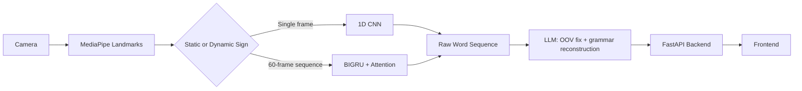

# 🤟 Real-Time Sign Language Recognition & Translation

AI system that recognizes ASL signs from camera input and translates them into fluent English. Combines a **static sign model**, a **dynamic sign model**, and an **LLM post-processing stage**, served via a **FastAPI** backend to an **HTML/CSS/JS** frontend.

[](https://www.python.org/)
[](https://pytorch.org/)
[](https://fastapi.tiangolo.com/)

---

## How it works



## Models

### Static — 1D CNN

**Pipeline:**
```
Image → MediaPipe Hand Landmarker (21 landmarks × x,y,z = 63 features)
      → wrist-centering (subtract wrist landmark)
      → augmentation: Gaussian noise, random scale, random translation
      → label encoding + stratified train/val/test split
      → reshape (N, 1, 63)
```

**Architecture:**
```
Conv1d(1→64, k=3) → BatchNorm → ReLU → MaxPool
Conv1d(64→128, k=3) → BatchNorm → ReLU → MaxPool
Flatten → Linear(→128) → Dropout(0.3) → Linear(→num_classes)
```

**Training:** CrossEntropyLoss (class-weighted) · Adam (lr 0.0005) · batch size 32 · early stopping (patience 1)
**Result:** 99.99% test accuracy

---

### Dynamic — BIGRU V3

**Pipeline:**
```
Raw sequence (60 frames × 155 features: 63 LH + 63 RH + 27 pose + 2 hand-presence flags)
      → mirror (deterministic dataset doubling)
      → augmentation: noise, scale, time-warp, time-shift, rotation, joint/frame dropout, Mixup
      → add velocity channel → 308 features (position + velocity + flags)
      → wrist-relative anchoring + separate z-score norm for position vs. velocity
```

**Architecture:**
```
LayerNorm(308)
→ BIGRU (hidden 256, bidirectional) → Dropout
→ BIGRU (hidden 128, bidirectional) → Dropout
→ Temporal Attention (learns which frames matter most)
→ fuse with hand-presence-flag embedding (64-dim)
→ Linear(320→512) → BatchNorm → Dropout → Linear(512→256) → Dropout → Linear(→num_classes)
```

**Training:** custom loss = label smoothing + focal weighting + class weights + confusion-cluster penalty · AdamW (lr 3e-4) + OneCycleLR · early stopping (patience 20) · weighted sampler for class/mirror balance
**Inference:** test-time augmentation (mirror + perturbed views, averaged), real-time mode returns "uncertain" below 40% confidence instead of guessing
**Result:** pipeline complete; not yet trained/evaluated (no logs available)

---

### LLM Module

Post-processes raw sign predictions in two steps:
1. **OOV handling** — unknown words (outside the ~120-word vocabulary) are mapped to the closest combination of known signs (e.g. "sandwich" → "bread" + "eat").
2. **Grammar reconstruction** — rewrites grammar-free ASL word order into one fluent English sentence, without adding meaning that wasn't signed.

Stateless API call, tightly prompted (one sentence, no invented content, preserve emotional words exactly). Falls back to the raw word sequence if the API is unavailable.

---

### Backend — FastAPI

Real-time inference server built on FastAPI:

- **`GET /api/health`** — reports whether the static/dynamic models and NLP module loaded successfully, available classes, and device (CPU/GPU).
- **`WS /ws`** — a persistent WebSocket per client session that streams landmark frames in and predictions out:
  - Binary messages carry a packed landmark frame (155 raw features, plus an optional 63-feature static-hand frame) parsed straight from bytes.
  - Dynamic predictions run on a rolling frame buffer once it reaches the fixed sequence length, using mirror-averaged inference; static predictions run per-frame with a cooldown.
  - Both branches smooth predictions over a short history (majority vote) rather than reacting to a single noisy frame, and apply a confidence threshold before returning a label vs. `"uncertain"`.
  - Text messages carry control actions (`toggle_mode`, `add`, `word`, `undo`, `toggle_llm`, `generate`, `clear`, `reset`) handled per-session.
- Models are loaded once at startup (`@app.on_event("startup")`) and kept in a shared in-memory `STATE` dict; a missing checkpoint logs a warning instead of crashing the app.
- CORS is configured via `CORSMiddleware` with an allow-list from config.
- The built frontend is mounted as static files at `/`, after the API/WebSocket routes so it doesn't shadow them.

---

### Frontend — HTML/CSS/JS

Single-page live camera UI (`index.html` + `style.css` + `app.js`):

- **Camera stage** — live video feed with a landmark overlay canvas, an FPS badge, and a mode badge (`STATIC` / `DYNAMIC`).
- **Prediction display** — current label + confidence, a buffer-fill bar showing progress toward the 60-frame dynamic window, and left/right hand-detected indicators.
- **Side panel** — top-5 prediction list, a gloss buffer (accumulated signed words), and a generated-sentence box.
- **Controls** — toggle mode, add prediction, finish word, undo, reset buffer, toggle landmark overlay, toggle LLM, generate sentence, clear all, speak sentence, auto-speak — each mirrored to a keyboard shortcut (Q/ESC, SPACE, R, C, A, W, B, L, G, X, V).
- **Speech** — uses the browser's built-in speech synthesis for reading the sentence aloud; no audio is sent to the server.
- **Status row** — live indicators for camera, model availability, and WebSocket connection.
- **Data flow** — landmarks are extracted client-side (MediaPipe Tasks Vision) and streamed to the FastAPI backend over the `/ws` WebSocket for classification; the server sends predictions back over the same socket.

## Requirements

```
torch
numpy
opencv-python
mediapipe
scikit-learn
joblib
matplotlib
fastapi
uvicorn
```

## Status

- Static model — done, verified 99.99% accuracy
- Dynamic model — pipeline complete, not yet trained/evaluated
- LLM module — designed, documented
- Backend — FastAPI (REST + WebSocket)
- Frontend — HTML/CSS/JS (live camera UI, MediaPipe Tasks Vision in-browser)
- Deployment — Docker, Azure

## GitHub

Full source, notebooks, and files are shared on GitHub.
